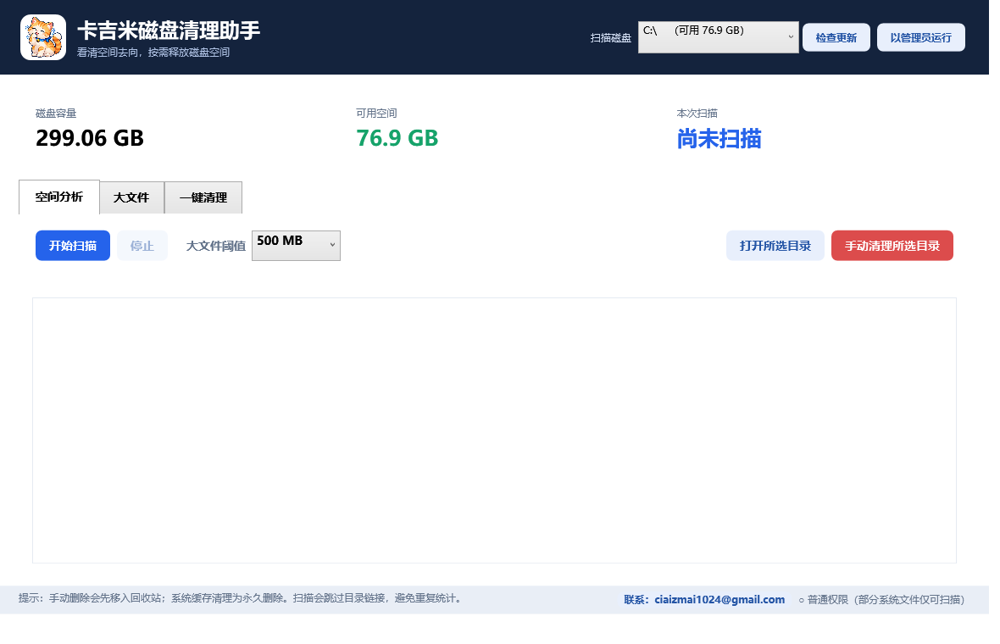
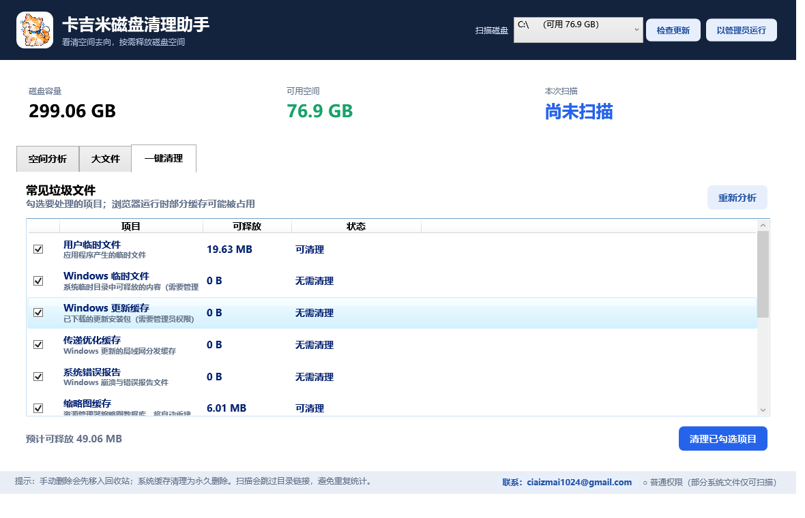

# 卡吉米磁盘清理助手

一个带卡吉米猫咪图标的原生 Windows 桌面程序，用于分析磁盘空间并按需清理常见垃圾文件。

[](https://github.com/ciaizmai1024-sudo/kajimi-disk-cleaner/actions/workflows/build.yml)
[](https://github.com/ciaizmai1024-sudo/kajimi-disk-cleaner/releases)
[](https://dotnet.microsoft.com/)
[](LICENSE)

## 软件截图

### 磁盘空间分析



### 垃圾清理项目



## 功能

- 选择任意已挂载磁盘，一键扫描全部普通及隐藏文件。
- 目录树逐层显示每个目录的总大小和文件数，并按占用从大到小排序。
- 自定义大文件阈值（100 MB / 500 MB / 1 GB），勾选后移入回收站。
- 勾选清理项目：用户/系统临时文件、Windows 更新缓存、传递优化缓存、错误报告、缩略图缓存、DirectX 缓存、浏览器缓存、旧日志和回收站。
- 支持打开目录、将整个所选目录移入回收站，以及提升为管理员权限。
- 遇到无权访问、被占用文件时自动跳过，不中断整个任务。
- 启动时自动检测 GitHub 新版本，也可点击“检查更新”。
- 内置反馈邮箱：[ciaizmai1024@gmail.com](mailto:ciaizmai1024@gmail.com)。

## 下载与运行

1. 从 [Releases](https://github.com/ciaizmai1024-sudo/kajimi-disk-cleaner/releases/latest) 下载 `KajimiDiskCleaner.exe`。
2. 双击运行，无需安装、无需额外下载 .NET 运行库。

这是一个自包含的单文件绿色版：没有安装程序、不写注册表，也不依赖系统预装 .NET；直接删除 EXE 即可移除。运行时可能在系统临时目录解压 .NET 原生组件。

清理 Windows 更新缓存、Windows 临时文件等系统位置时，点击右上角“以管理员运行”。建议先关闭浏览器，再清理浏览器缓存。

## 构建

普通开发构建：

```powershell
dotnet build KajimiDiskCleaner.csproj -c Release
```

生成单文件绿色版：

```powershell
.\build-portable.ps1
```

输出文件为 `dist/KajimiDiskCleaner.exe`。

生成 README 截图：

```powershell
.\dist\KajimiDiskCleaner.exe --screenshots .\docs\images
```

## GitHub 自动构建

- 每次推送到 `main`：自动编译、生成 Actions 构建产物，并按项目中的 `Version` 创建或更新 Release。
- 每个 Pull Request：自动验证项目能否成功构建。
- 推送 `v*` 标签（例如 `v1.2.0`）：同样会自动创建 GitHub Release，并附加单文件 `KajimiDiskCleaner.exe`。
- 也可以在 Actions 页面手动运行 `Build Windows Portable EXE`。

发布新版本时修改 `KajimiDiskCleaner.csproj` 中的 `<Version>`，提交到 `main` 即可。也可手动推送标签：

```powershell
git tag -a v1.2.0 -m "v1.2.0"
git push origin v1.2.0
```

## 清理行为

- “大文件”和目录树中的“手动清理”会将内容移入回收站，可恢复。
- “一键清理”中的缓存和日志为永久删除；每一项均可取消勾选。
- 程序跳过目录链接/重解析点，避免循环扫描和重复统计。

## 系统要求

- Windows 10 / Windows 11（64 位）

## 许可证

[MIT License](LICENSE)


